# A-Secure-Node-js-REST-API-with-Json file storage

***

***

## This Nodejs REST API part two is intended to be secure and user-friendly, and it makes use of best API practices

***

The APIs could be improve over time to be more secure.

## Check out [Build-a-Secure-Nodejs-REST-API-part-two github repo](https://github.com/rqkohistani/Build-a-Secure-Node-js-REST-API-part-two-with-mysql)

## Chekc out [Nodejs-REST-API-part-three uses **PRISMA** and Azure Data Studio for storage](https://github.com/rqkohistani/a-secure-nodejs-REST-APIs-USING-PRISMA)

***

## Steps to run Node JS REST API part two

***

## How to export the APIs to Postman

1. Download the Nodejs REST API partOne V1 .postman_collection.json file on the current repo
2. Open Postman
3. Select the import icon.
4. Upload the Nodejs REST API partOne V1 .postman_collection.json file
5. Go to auth/login and enter the username and password

***

## Clone the repo

1. npm install
2. npm start
3. [Open the browser](http://localhost:3000)

## 3 Login

### Login with username and password

1. dataBaseJson
      - adminsAndUsersLists
      - select an admin or user
2. Save the token
    - Click on the Nodejs REST API part one V1 collection
    - Go to Variables
    - Paste in the token
    - tokenPartOneV1
    - Make sure one of tokenPartOneV1 is selected.
      - Multiple of tokenPartOneV1 can be used but one must be selected at the time.
    - Note: at the same multiple user could been logged in.
    - click on the Save button
    - 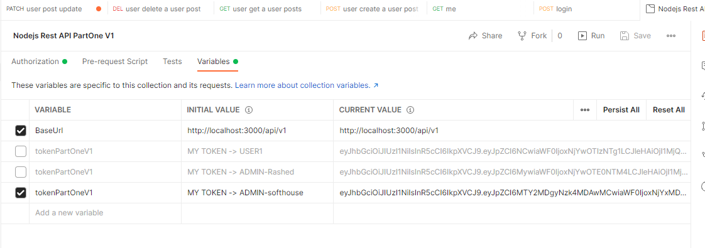

3. The  ***Get ...auth/me** route will return the user who is logged in.
    - Click on the me route
    - Click on the Send button
    - if successful you should see the following
    - else you will see a "message": "Invalid token"
    - 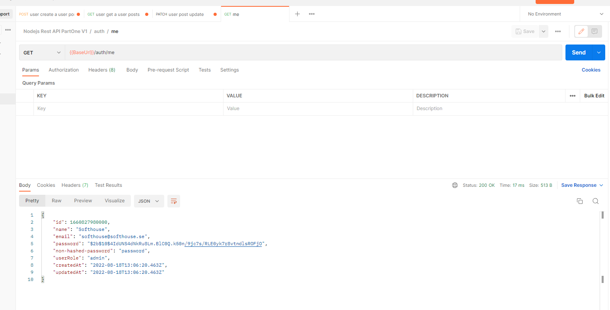

***

- superadmin

          {
          "email": "softhouse@gmail.com",
          "password": "password"    
           } 

***  

- admin

          {
          "email": "admin@gmail.com",
          "password": "password"    
           } 

***

- user

          {
          "user1": "admin@gmail.com",
          "password": "password"    
           } 

***

### Create an admin or user

1. Click on the admin/admin post route
2. Fill new Admin or user credentials in the Body
3. Validation would take care of if unnecessary fields are added.
4. Click Send
5. 
6. 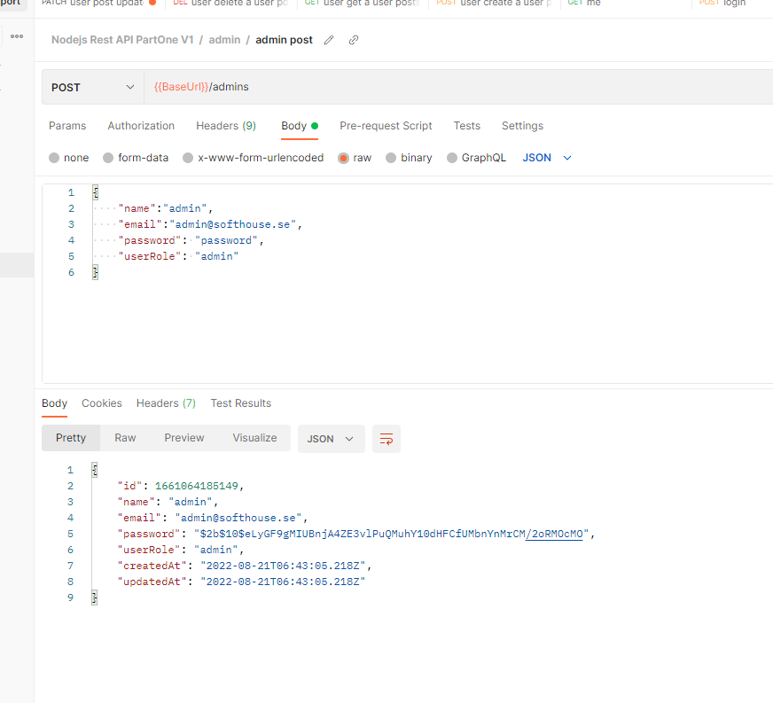

***

### Update an admin or user

1. Click on the admin/admin upate route
2. Edit Admin or user credentials in the Body
3. Params
    - id: the id of the admin or user
4. Validation would take care of if unnecessary fields are added.
5. Click Send
6. 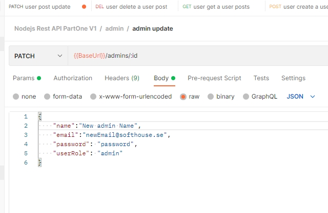
7. 
    - Check the data or get the admin or user route to see if the admin or user has been updated

8. 

### Other admin or user routes are the same. you can check them out. You got the idea

The rest would be the same. You got the idea.

***

## Create a new user

### OBS: the user is not an admin or user. It could be renamed to customer or client. lets keep it this way for now

1. Click on the user/user route
2. Fill new user credentials in the Body
3. Validation would take care of if unnecessary fields are added.
4. Click Send
5. 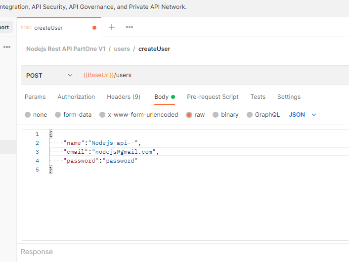
6. 
7. Go to getAllUsers route
    - The newly created user should be in the list

***

## Update a user

1. Before updating the user details
1. 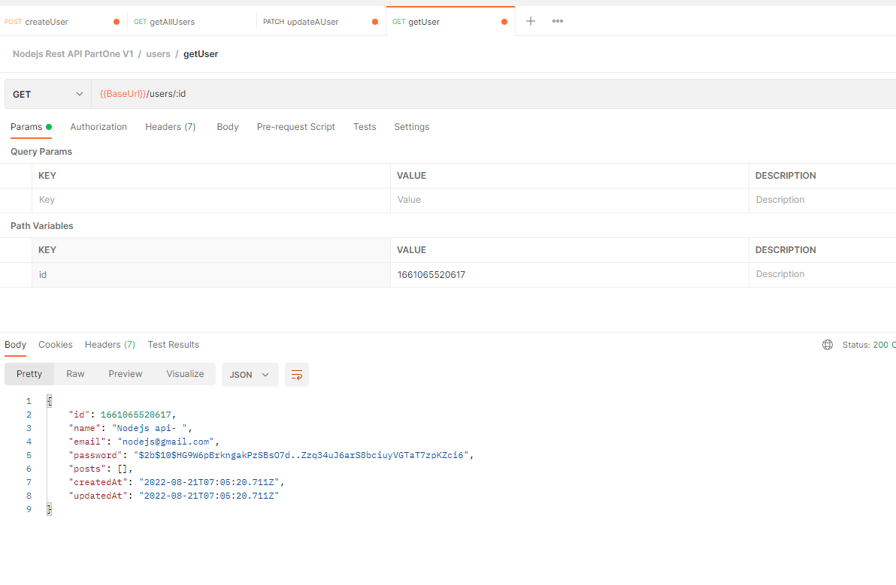
1. Click on the user/user update route
1. Edit user credentials in the Body
1. Params
    - id: the id of the user
1. Validation would take care of if unnecessary fields 1re added.
1. Click Send
1. 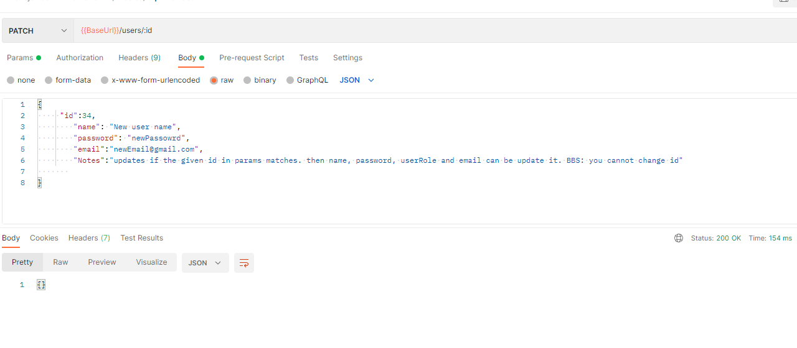
    - check the data or get the user route to see if the user has been updated

1. 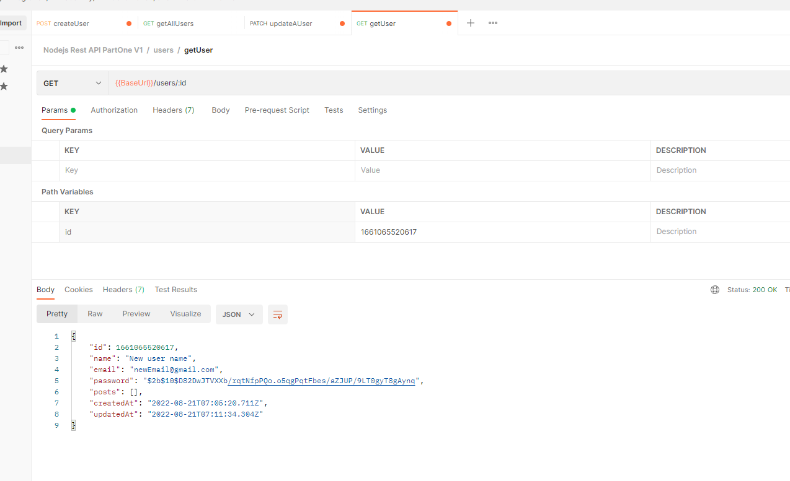

## Delete a user

Delete a user without the secret word "secret" is not allowed. However, permission can be added or remvoed to roles.json file to prevent deletion of a user.
Lets keep it this way for now.

1. Click on the user/user delete route
2. Params
    - id: the id of the user
3. Body
    - secret: "secret"
4. Click Send
5. 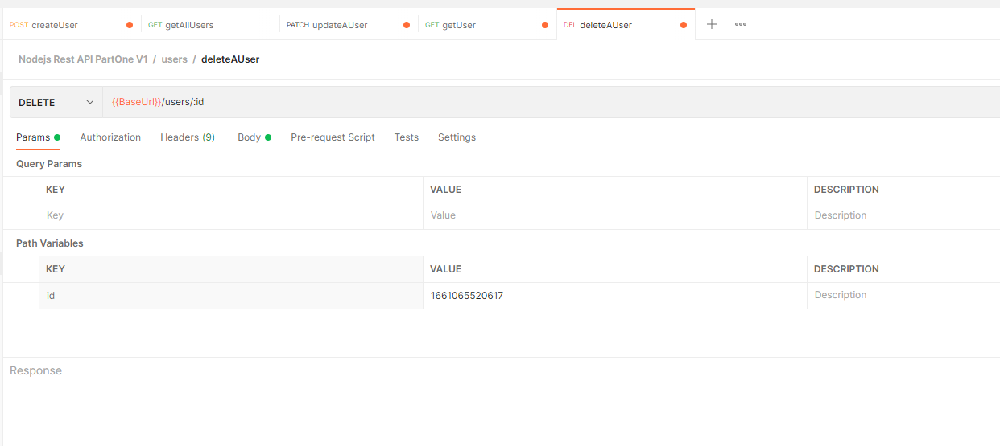
6. 
7. 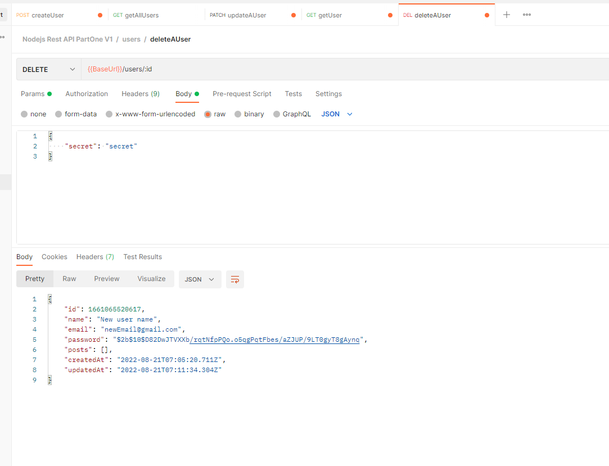

***

## Create a user post

1. Click on the user/user post route
2. Fill the post body with userId, title and body in as the json format
3. OBS: Validation would take care of if unnecessary fields are added.
4. Click Send
5. 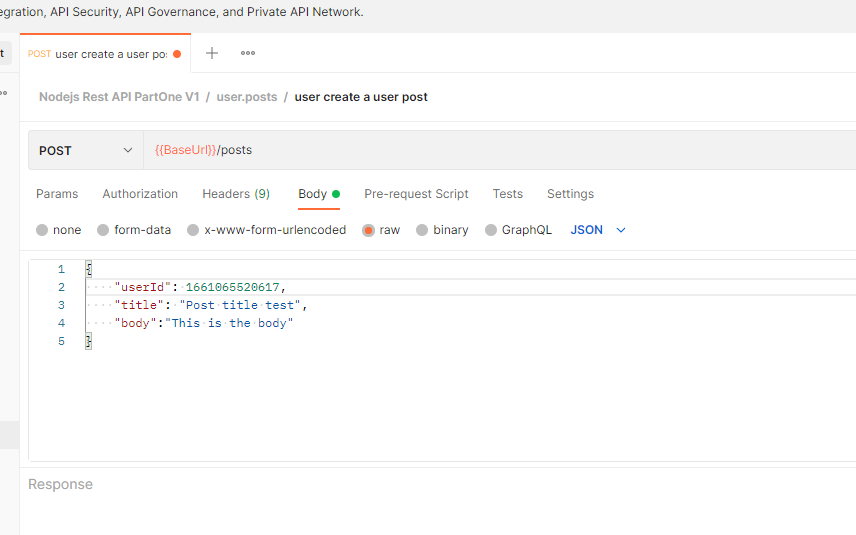
6. 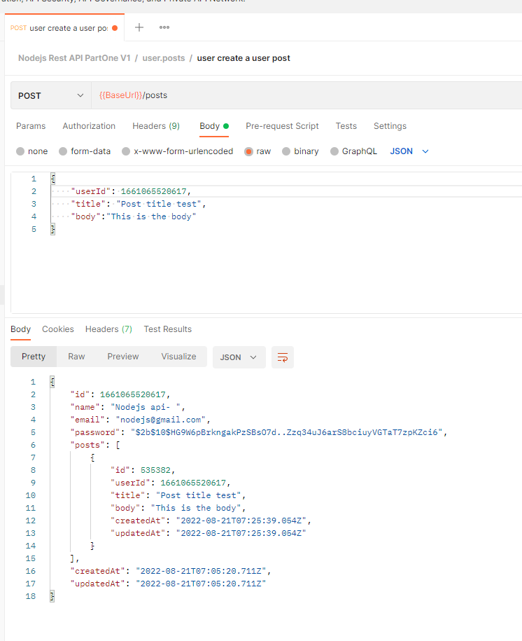
7. Go to user get a user post by user id
    - You should see the new user post

8. 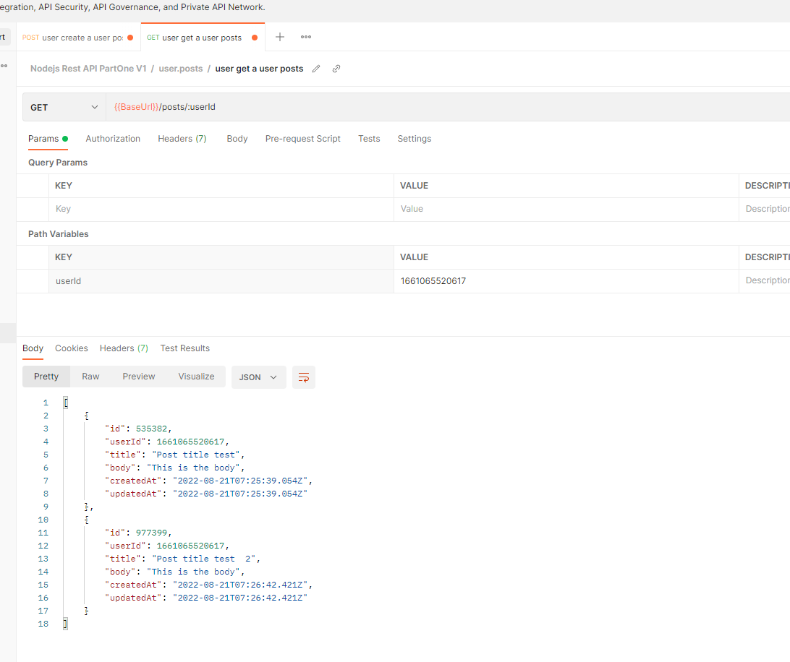

***

## Update a user post

1. Click on the user/user post update route
2. Edit user post userId, title and body in the Body
3. Params
    - id: the id of the user post
4. Validation would take care of if unnecessary fields are added.
5. Click Send
6. 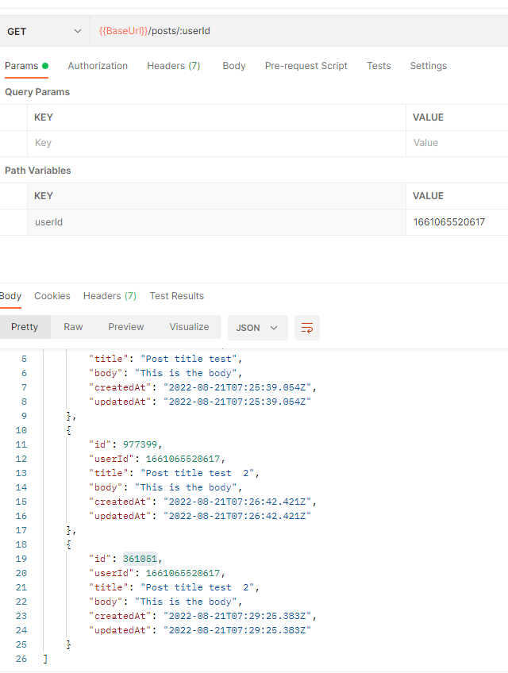
7. 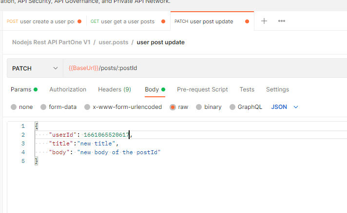
8. 
9. 
    - check the data or get the user post route to see if the user post has been updated

## Delete user post

1. Click on the user/user post delete route
2. Params
    - id: the id of the user post
3. userId
    - id: the id of the user in body
4. Click Send

***

### THANK YOU FOR READING THIS DOCUMENTATION. I HOPE YOU ENJOYED IT

Perharps there are some bugs in the code. Please feel free to contact me.

## [linkedIn](https://www.linkedin.com/in/rashed-qazizada-1b64b68a/)
